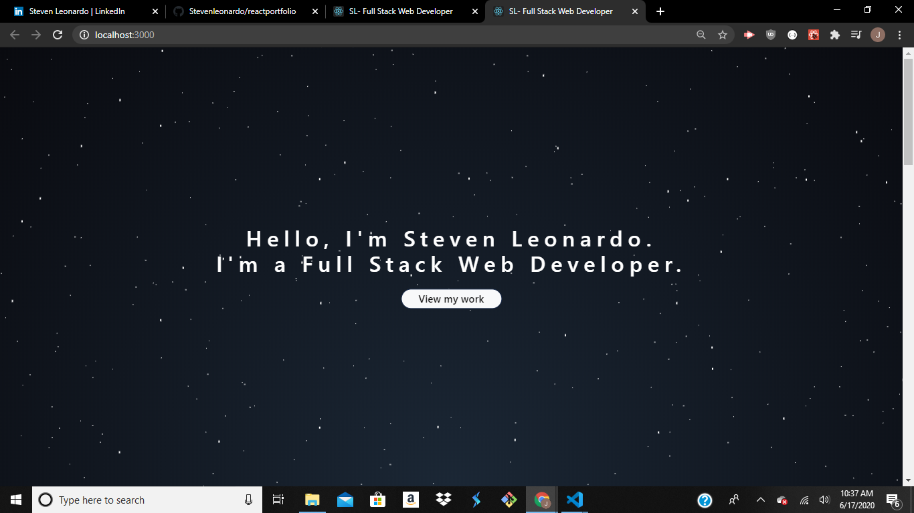

# React Portfolio

Project Title
This is a react portfolio application where displays information about me, project work and the ability to design and show the use of REACT. Through the use of animate.css I was able to not only move the css
but also how the information is presented when scrolling down.

Getting Started
You can get a verison of this product up and running through heroku and can see the code through the github
page.

Prerequisites
Install
-react
-react-dom
-animate.css
-wow.js
-bootstrap

Deployment
Heroku

Try Me Live
<a href="https://ancient-sands-46959.herokuapp.com/">https://ancient-sands-46959.herokuapp.com/</a>

Built With
React
Animate.css
Wow.js
Bootstrap

Contributing
Please read CONTRIBUTING.md for details on our code of conduct, and the process for submitting pull requests to us.

Authors
Steven Leonardo

License
This project is licensed under the MIT License
Full Stack Project starter with basic components routes and authentication. The project is in MVC format

## Purpose and Inspiration
You can fork and run this to quickly have an MVC project up and running, then simply add the controllers models and components that your project needs. I wanted to have a place to start with no other models than the User model. This is currently at the point where you can:

## MVC
This project is structured in Full Stack Javascript with REACT Views and Controllers.

## Tech Stack
+ [ANIMATE.CSS]
+ [BOOTSTRAP]
+ [REACT](https://reactjs.org/)
+ [NODE](https://nodejs.org/en/)
+ [WOWJS]

#### Install and run
Install all the dependencies with NPM
`npm install`  
Then start the project
`npm start`

